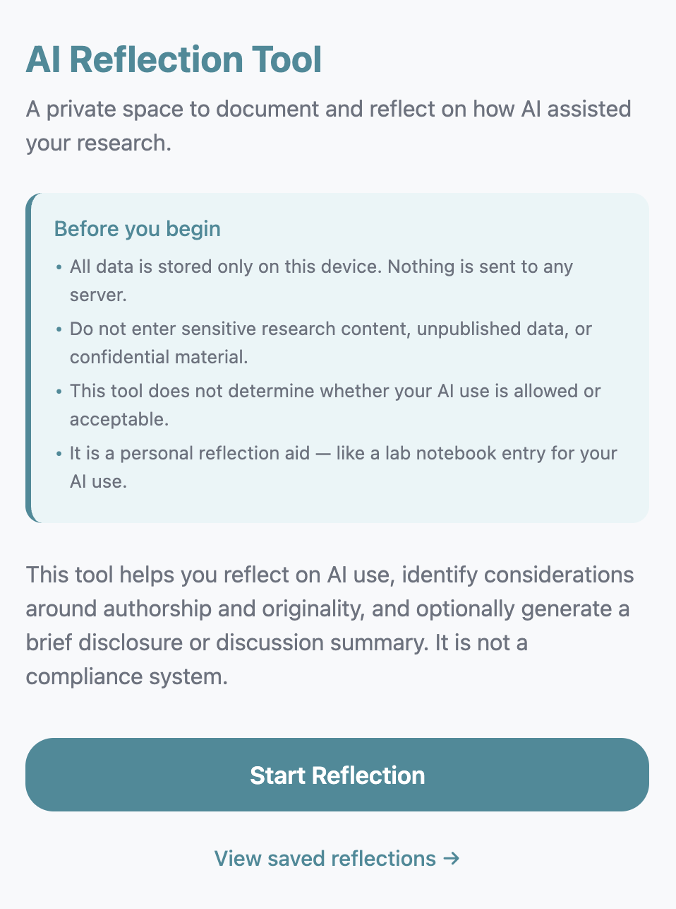
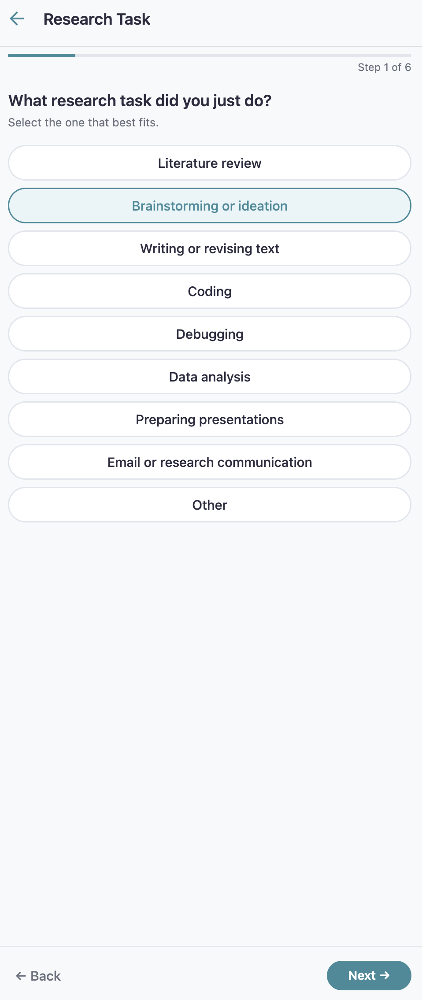
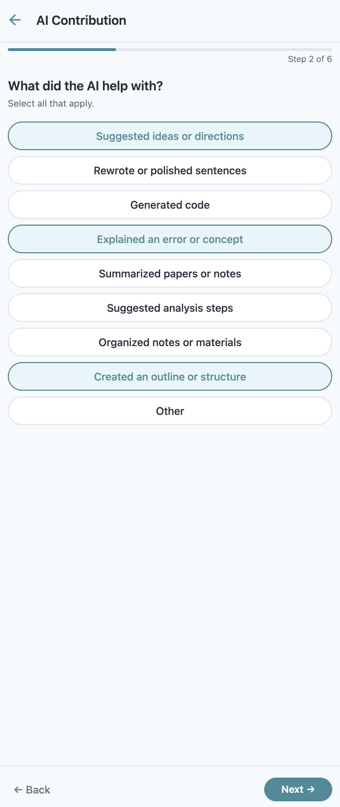
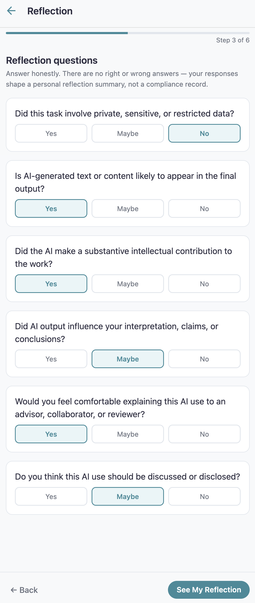
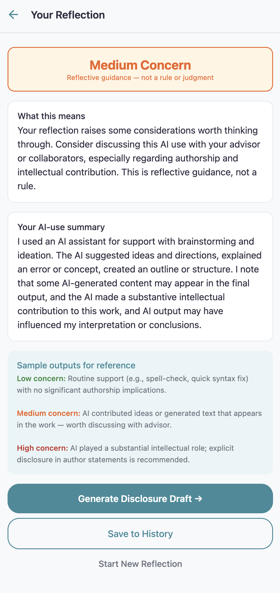
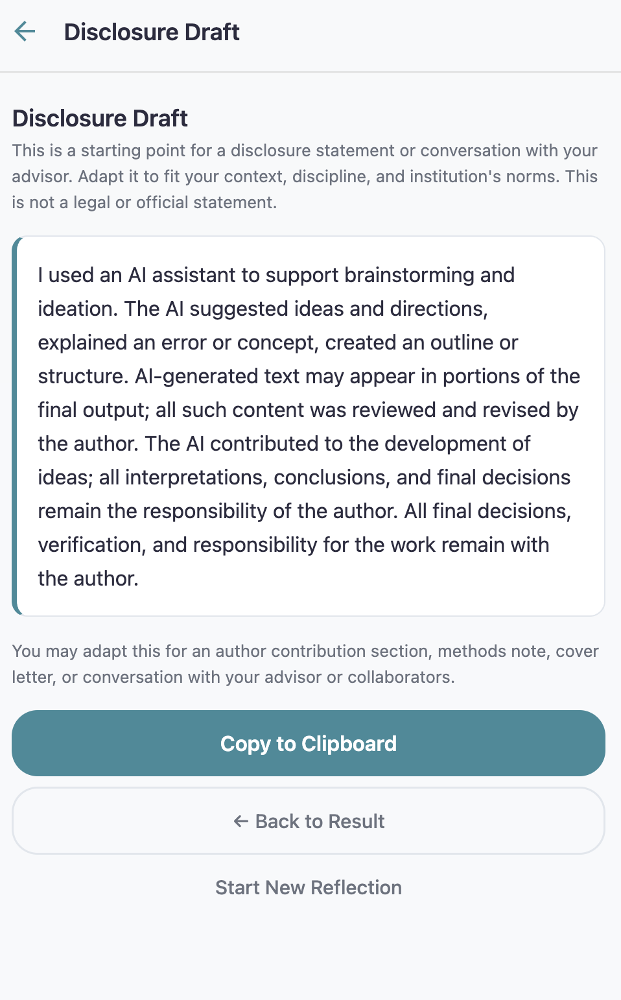

# AI Use Reflection and Disclosure Tool

A lightweight mobile app prototype that helps doctoral students reflect on, document, and optionally disclose their use of AI tools in research tasks.

Built as a research prototype for **SI 840: Research Design** (Graduate-level HCI System-Building Study).

## What This App Does

- Guides users through a short reflection wizard after using an AI tool for a research task
- Generates a personalized AI-use summary and a nonjudgmental reflection category (Low / Medium / High Concern)
- Optionally produces a disclosure draft that users can adapt for author statements, methods sections, or advisor conversations
- Stores all reflections locally on the device — no server, no login, no network

## What This App Does NOT Do

- Monitor, police, or judge AI use
- Determine whether AI use is ethical, allowed, or acceptable
- Send data to any server or third party
- Require users to paste sensitive research content

## Screenshots

| Welcome & Privacy Notice | Select Research Task | Select AI Contribution |
|:---:|:---:|:---:|
|  |  |  |

| Reflection Questions | Reflection Result | Disclosure Draft |
|:---:|:---:|:---:|
|  |  |  |

## App Flow

```
Screen 1: Welcome & Privacy Notice
    |
Screen 2: Select Research Task (single-select, 9 types)
    |
Screen 3: Select AI Contribution (multi-select, 9 types)
    |
Screen 4: Reflection Questions (6 yes/no/maybe questions)
    |
Screen 5: Reflection Result (category + summary + guidance)
    |
Screen 6: Optional Disclosure Draft (copy to clipboard)
    |
Screen 7: Saved Reflections / History (local, deletable)
```

## Tech Stack

- React Native + Expo (SDK 54)
- JavaScript
- React Navigation (stack navigator)
- AsyncStorage (local persistence)
- No external APIs, no login, no backend

## Quick Start

### Prerequisites

- [Miniconda or Anaconda](https://docs.conda.io/en/latest/miniconda.html)

### Setup (run once)

```bash
bash setup.sh
```

Or manually:

```bash
conda create -n si840-expo nodejs=24 -y
conda activate si840-expo
cd ai-reflection-tool
npm install
npx expo install react-dom react-native-web
```

### Run the App

**Web browser (recommended for screenshots):**

```bash
conda activate si840-expo
npx expo start --web
```

Opens at `http://localhost:8081`. Resize your browser to a narrow portrait width (~390px) for mobile preview.

**Phone (via Expo Go):**

```bash
conda activate si840-expo
npx expo start
```

Scan the QR code with Expo Go (iOS: Camera app; Android: Expo Go app).

### Remote Server Access

If running on a remote Linux server, use SSH port forwarding from your local machine:

```bash
ssh -L 8081:localhost:8081 <your-username>@<server-hostname>
```

Then open `http://localhost:8081` in your local browser.

## Project Structure

```
ai-reflection-tool/
├── App.js                          # Navigation root
├── app.json                        # Expo config
├── setup.sh                        # One-time environment setup
├── RUNNING.md                      # Detailed run instructions
├── DESIGN.md                       # Design rationale, storyboard, UX microcopy,
│                                   #   privacy notice, and design risks
├── src/
│   ├── theme/index.js              # Colors, typography, spacing tokens
│   ├── utils/
│   │   ├── reflectionLogic.js      # Scoring + text generation (pure function)
│   │   └── storage.js              # AsyncStorage read/write/delete
│   ├── components/
│   │   ├── ProgressBar.js          # "Step N of 6" bar
│   │   ├── OptionButton.js         # Selectable pill button
│   │   └── YesNoMaybe.js           # 3-way toggle row
│   └── screens/
│       ├── WelcomeScreen.js        # Screen 1: Welcome + privacy notice
│       ├── TaskSelectScreen.js     # Screen 2: Research task picker
│       ├── AIContributionScreen.js # Screen 3: AI contribution multi-select
│       ├── ReflectionScreen.js     # Screen 4: 6 reflection questions
│       ├── ResultScreen.js         # Screen 5: Category + summary + guidance
│       ├── DisclosureScreen.js     # Screen 6: Optional disclosure draft
│       └── HistoryScreen.js        # Screen 7: Saved reflections list
```

## Reflection Scoring

The app scores 6 yes/no/maybe questions (yes=2, maybe=1, no=0). Question 5 is inverted — answering "no" (not comfortable explaining) increases the score.

| Score | Category | Guidance |
|-------|----------|----------|
| 0–3 | Low Concern | Likely routine; keep a record, use your judgment |
| 4–7 | Medium Concern | Consider discussing with advisor or collaborators |
| 8–12 | High Concern | Explicit disclosure or discussion recommended |

All categories are labeled **"Reflective guidance — not a rule or judgment."**

## Design Principles

1. **Supportive, not punitive** — no surveillance, no moralizing language
2. **Lightweight** — under 2 minutes per reflection
3. **No moralizing** — avoids "cheating," "misuse," "violation"
4. **Reflective judgment** — surfaces considerations, does not decide acceptability
5. **Researcher audience** — graduate-level vocabulary, real research workflows
6. **Privacy-by-design** — no login, no network, no sensitive content input

## Documentation

| Document | Contents |
|----------|----------|
| [RUNNING.md](RUNNING.md) | Detailed setup and run instructions, SSH tunneling, screenshot guide |
| [DESIGN.md](DESIGN.md) | Design rationale, user journey, screen-by-screen UX microcopy, privacy notice, design risks and mitigations |

## Privacy

All data stays on-device. No network requests. No login. No text input of research content. Users can delete any saved entry at any time.

## License

Research prototype for academic coursework. Not intended for production use.
